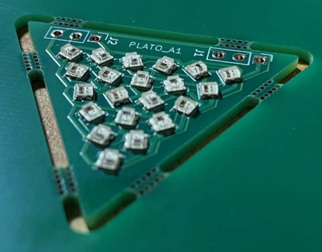
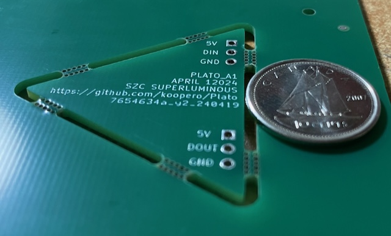
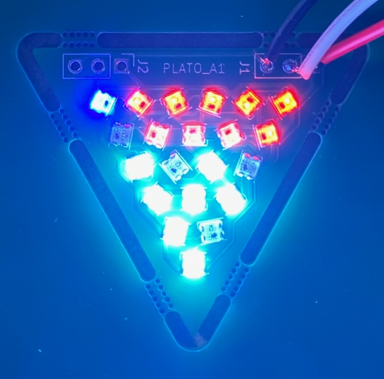

# Plato_A1

A regular triangle, made of light and plastic, with a dimension of about an inch. This subassembly is meant as an experiment in:

- **Parametric Geometry** : 
- **Electronic Basics** : 
- **LED placement** : The triangular shape of the piece makes cartesian component alignment unfeasible. Therfore, the LEDs are align in a triagnular grid. Additionally, the LEDs are oriented towards the centre of the piece, for aesthetics and to diffuse potential chromatric anisotropy.

# Revision 1

*Please note that this design has failed testing and should not be used.*

## Process

- Collaborate with ChapGPT & Copilot to prototype design generation scripts ( `Plato_A1_design.py` and `kicad_align_leds.py` )
- Tune parameters in design script to taste.
- Start a new project in Kicad
- Design circuit schematic in Kicad, consisting of 21 WS2812B 2020 LEDs and 2 3-pin jumper connectors. Ensure that all LEDs are sequentially named in the format `D1` to `D21`.
- Switch to PCB designer and import generated file `Plato_A1_board.dxf` into edge cut layer.
- Copy and paste the script `kicad_align_leds.py` into Kicad's scripting console to position LEDs.
- Manually place the jumper connectors.
- Draw routes to connect all components. Some LEDs are rotated in 90 degree increments for better connectivity.
- Add text and graphics the back silkscreen.
- Use Kicad's Fabrication Toolkit plugin to aid in preparing the board for fabrication.
- Use [JLCPCB](https://jlcpcb.com/)'s online tools to order 5 copies of the board.

## Result

Customer experience ordering from JLCPCB was exemplary. Representatives followed up for confirmation of the circuit's polarity (understandable given the non-traditional nature of the design).

Total cost for PCB manufacturing, assembly and shipping was about $100CAD. 

After unboxing, a quick test rig was produced, consisting of 3 jumper wires connected to a generic ESP32 Devkit V1, powered by USB. [WLED](https://install.wled.me/) was installed to produce a WS2811 signal.

Upon testing, the boards failed to maintain a coherent LED signal. About half the lamps will respond to a signal, but their performance is intermittent. By the end of the chain, the signal is lost completely.

## Lessons Learned

- PCB fabrication and assembly is a painless and relatively inexpensive process.
- Use power and ground planes in designing future PCBs.
- Decoupling capacitors and noise-supressing resistors will be necessary in subsequent designs.
- The chromatic anisotropy of WS2812B 2020 is much less pronounced than 5050 versions. Fun geometric placement will be de-prioritized in future version.
- Don't forget to choose the PCB colour when ordering!

## Next Steps

- Add through hole capacitors in attempt to stabilize boards.
- Assemble sample boards with Plato_C1 casing to demonstrate an illuminated, if uncontrolled, tetrahedron.
- Assemble content pertaining to creation of object.
- Research reference designs for WS2812B 2020 circuit boards.
- Redesign `Plato_A1` with similar dimensions and specifications, incorporating better electronic practices.
